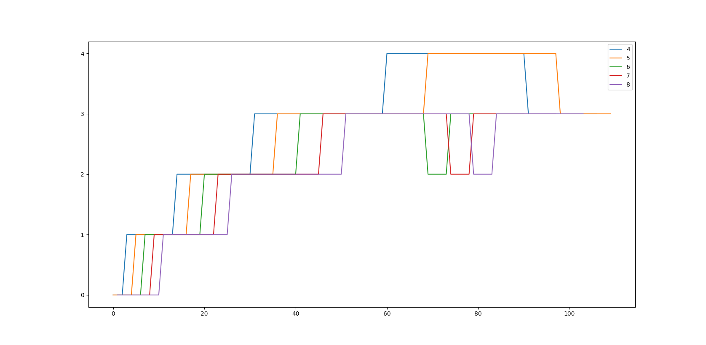

# Assignment 5 : Enhancing xv6 OS

## Additions made in `proc` struct

-   **`int ctime`** : To store the creation time of process. Is set when process is created.
-   **`int etime`** : To store the end time of process. Is set when process is exited.
-   **`rtime`** : To store the running time of process. Is set to 0 on creation and incremented on each clock tick if the process was in `RUNNING` state.
-   **`int iotime`** : To store the sleeping (I/O) time of process. Is set to 0 at time of process creation and incremented on each clock tick if the process was in `SLEEPING` state.
-   **`int priority`**: To store priority of the process. It is initialized to 60 on creation. and can be changed be `set_priority`.
-   **`int timeslices`**: Variable to store how many times it was run with the current priority (used to break tie in PBS scheduling).
-   **`ps_wtime`** : Current waiting time.
-   **`n_run`** : Number of times the process was picked by schedular.

For MLFQ scheduling:

-   **`int cticks`**: Variable to store ticks consumed while running in current queue (in MLFQ scheduling).
-   **`int queue`**: Variable to store the current queue (MLFQ scheduling).
-   **`int got_queue`**: An extra safe gaurd while queue allocation, it is 1 if a process is in any queue and is 0 of it is not in any queue.
-   **`int talloc`**: To store ticks at time of last queue allocation. Age of the process is calculated using this.
-   **`int q_ticks[5]`**: To store ticks spent running in queue i.

## Task 1

### waitx

```c
int waitx(int *wtime, int *rtime);
```

This syscall stores the waiting time (time for which the process was waiting to be scheduled) in `wtime` and running time (time for which the process was in running state (on CPU)) in `rtime`.

-   **`wtime`**: It is calculated as `p->etime - p->ctime - p->rtime - p->iotime`
-   **`rtime`**: = `p->rtime`

`time` user command has also been implemented to print `rtime`, `wtime` of a process

```
time com arg` ...
```

### ps

A syscall was implemented for this, (my_ps)

```c
int my_ps(void);
```

It just traverses over all the processes and prints required information

## Task 2

### First come first serve (FCFS)

For this the process with lowest `ctime` (creation time) is selected.

### Priority Based scheduling (PBS)

It selects a process with highest priority (lowest `priority` value). And use round robin for same priority.

#### set_priority syscall

```c
int set_priority(int new_prior, int pid);
```

It sets the priority of the pid to new_prior and if the priority is increased (`new_prior` < `old_priority`), scheduling takes place again.

Returns old_priority

If new_prior was invalid or there was not process with given pid. -1 is returned and nothing is done.

#### setPriority user program

Can be used in shell as

```
setPriority new_priority pid
```

Uses set_priority syscall.

### Multilevel feedback queue (MLFQ)

This is a bit complicated. Same implementation has been done as in assignment doc, therefore copy-pasting from there.

**Scheduler Details:-**

1. Five priority queues, with the highest priority being number as 0 and
   the bottom queue with the lowest priority as 4.
2. ​ The time-slice for priority 0 should be 1 timer tick. The times-slice for priority 1
   is 2 timer ticks; for priority 2, it is 4 timer ticks; for priority 3, it is 8 timer ticks;
   for priority 4, it is 16 timer ticks.

**Procedure:-**

1. ​ On the initiation of a process, push it to the end of the highest priority queue.

2. ​ The highest priority queue should be running always, if not empty.

3. If the process completes, it leaves the system.

4. ​ If the process uses the complete time slice assigned for its current priority
   queue, it is preempted and ​ inserted at the end of the next lower level queue.

5. ​ If a process voluntarily relinquishes control of the CPU, it leaves the queuing
   network, and when the process becomes ready again after the I/O, it is​ ​ inserted
   at the tail of the same queue, from which it is relinquished earlier​.

6. ​ A round-robin scheduler should be used for processes at the lowest priority
   queue.

7. ​ To prevent starvation, aging phenomenon:-

    a.​ If the wait time of a process in lower priority queues exceeds a given limit (25 ticks), their priority is increased and they are pushed to the next higher priority queue.

    b.​ The wait time is reset to 0 whenever a process gets selected by the scheduler or if a change in the queue takes place (because of aging).

Processes can make disadvantage of point 5 as a CPU bound can run for sometime less that the ticks for that queue and then go for I/O only for a small time. And when it wakes up it is assigned to the same queue (as it itself left the CPU before time limit).

## Comparison of schedulers

There are 2 benchmarks `benchmark` and `benchmark1`

`benchmark1` is the given benchmark. It was creating CPU bound processes squentially so i created 1 (`benchmark`) with dispersed collection of I/O bound and CPU bound processes.

Total ticks taken:

| Schedular | benchmark | benchmark1 |
| :-------: | :-------: | :--------: |
|    RR     |   1674    |    2013    |
|   FCFS    |   2662    |    3794    |
|    PBS    |   2145    |    2004    |
|   MLFQ    |   1695    |    2050    |

## Bonus

python was used to plot the graph (`graph.py`) using logs in file `logs`.
Each line in logs is

`ticks pid queue`

This is printed every tick for processes who are either runnable, sleeping or running and pid > 3


